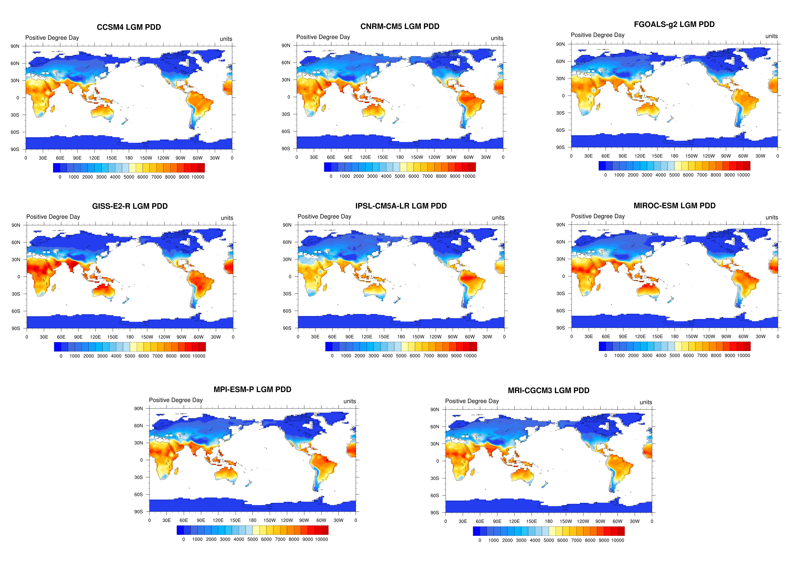
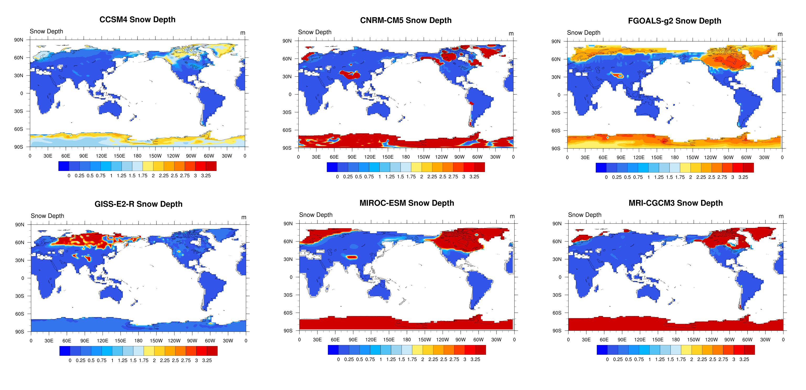

For Surface Mass Balance & SND
==============================
There are some NCL scripts for calculating surface mass balance and snow depth of 8 models (CCSM4, CNRM-CM5, FGOALS-g2, GISS-E2-R, IPSL-CM5A-LR, MIROC-ESM, MPI-ESM-P, MRI-CGCM3). Before calculating surface mass balance, we should get PDD (Positive Degree Day).
##Steps of calculating PDD:
(1) Run test.ncl to get re_monthlydata.txt;
(2) Run prsn_output.ncl to get tprsn.txt;
(3) Add re_monthlydata.txt and tprsn.txt into PDD_VCPP to get re_output.txt;
(4) Run nc_out.ncl to get re_pdd.nc;
(5) Run new_drawpdd.ncl to show the spatial mode of PDD.

##Steps of calculating surface mass balance:
(1) Run balance.ncl to get balance.nc;
(2) Run overlay.ncl to show the spatial mode of surface mass balance.

##The step of calculating snow depth:
Run draw_snd.ncl

